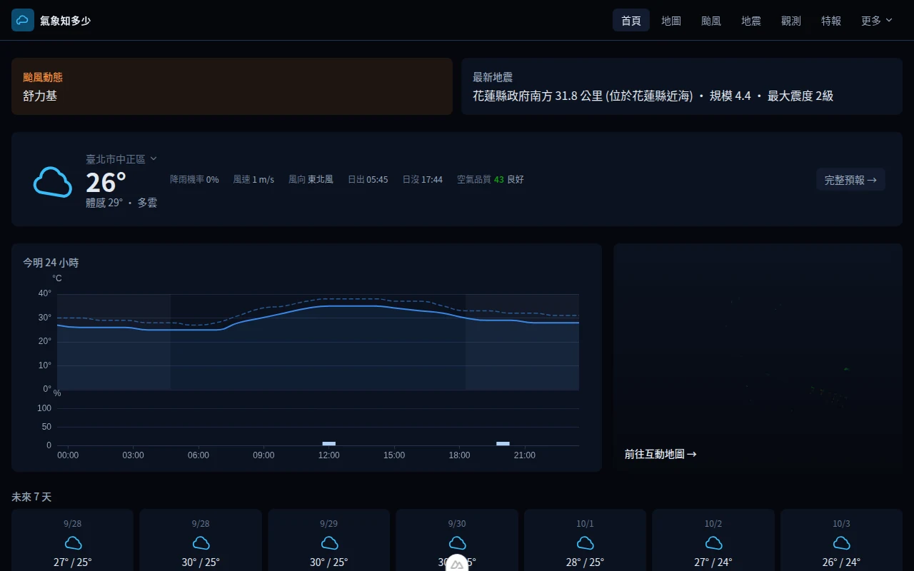
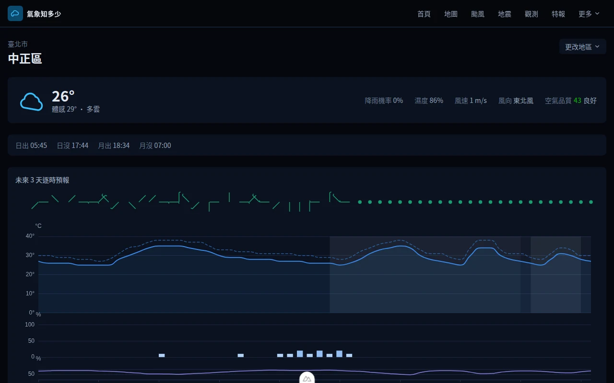
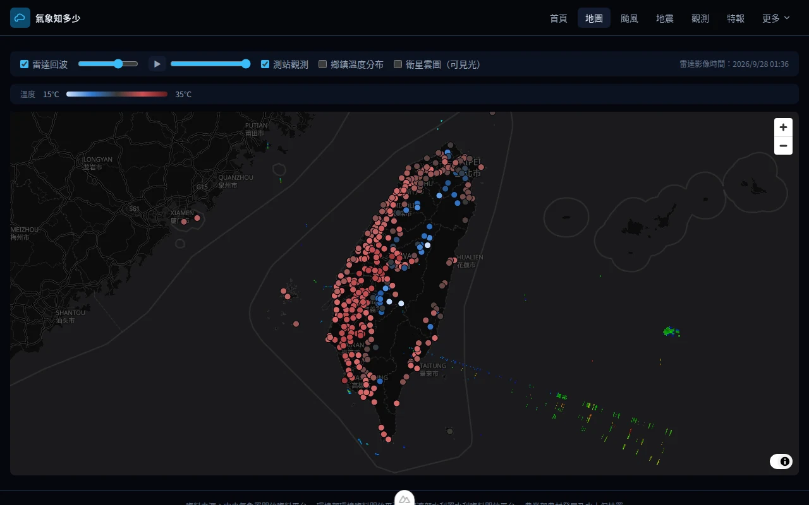
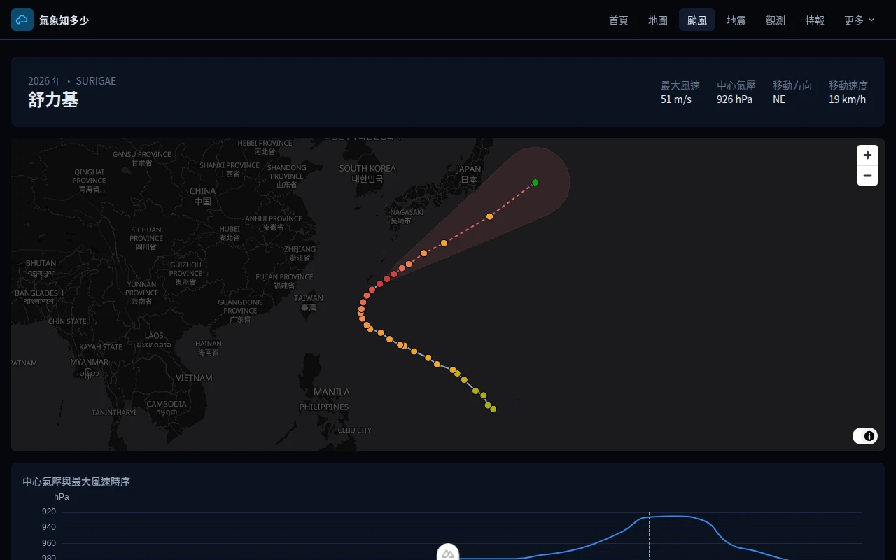
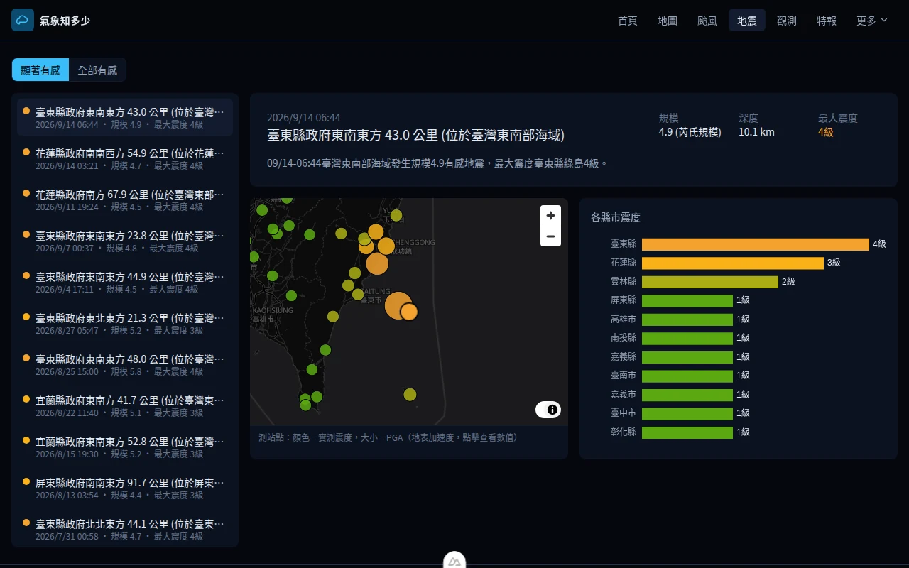
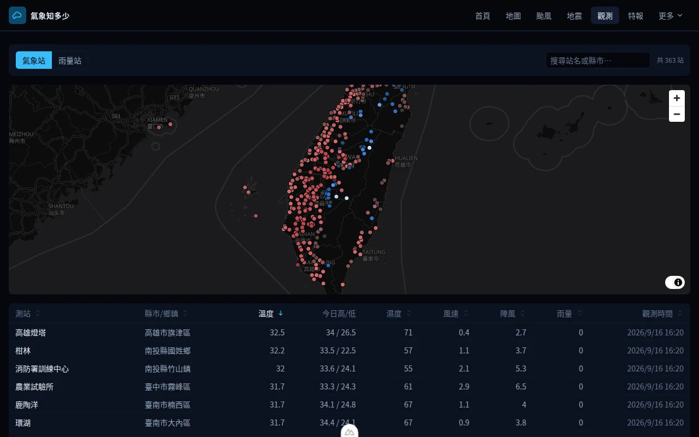
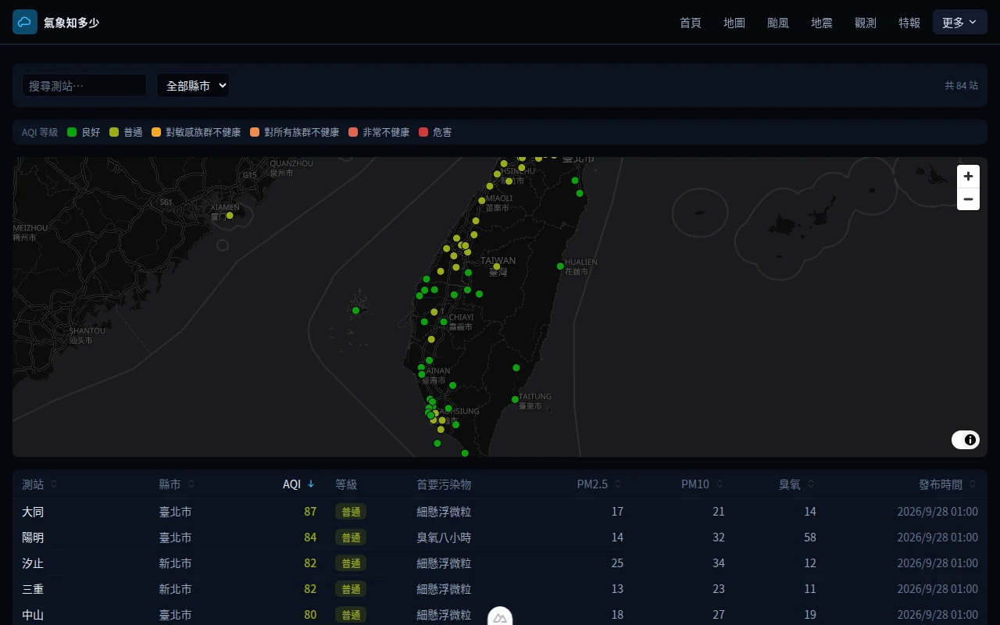
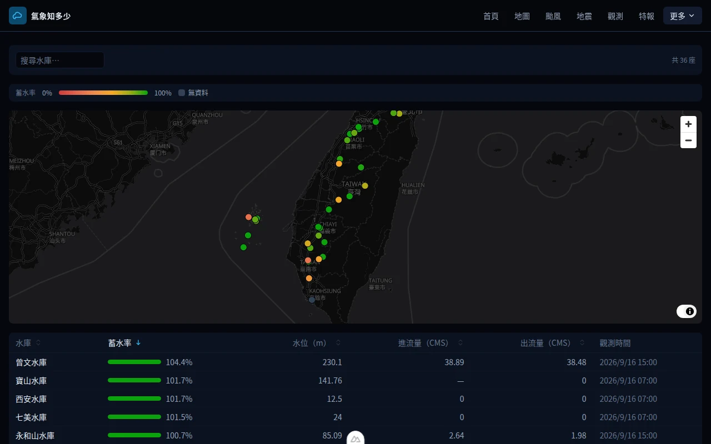
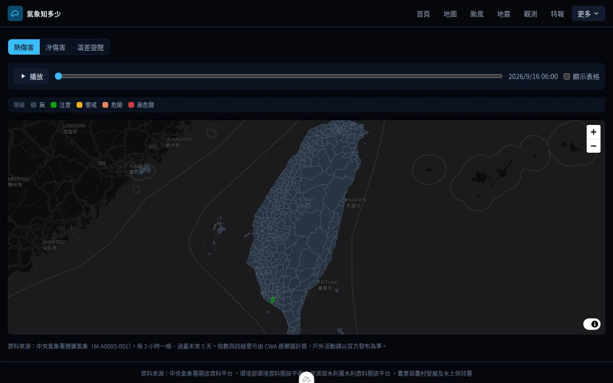
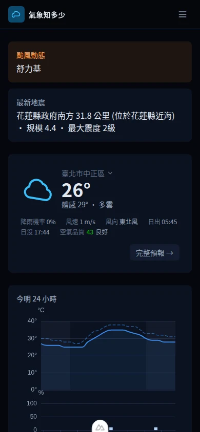

# 氣象知多少

台灣天氣資訊平台 —— 即時預報、雷達回波、颱風路徑與地震資訊，資料全部來自中央氣象署開放資料平台（CWA Open Data）。

[](https://github.com/lemoncat0817/weather-tw/actions/workflows/deploy.yml)
[](https://nuxt.com)
[](https://workers.cloudflare.com)

**線上版本：[weather-tw.jimdeng0817.workers.dev](https://weather-tw.jimdeng0817.workers.dev)**

<div align="center">
  
</div>

## 畫面預覽

全站採深色模式優先（Dark Mode First）現代化 UI 設計，結合 MapLibre GL 互動向量地圖與 ECharts 即時視覺化圖表，完整呈現全台即時氣候與災害告警資訊。

| 首頁即時氣象總覽 | 鄉鎮精準天氣預報 |
| :---: | :---: |
| **現況總覽／24h Meteogram／7日預報**<br>整合即時氣溫、體感溫度、風向風速、24 小時晝夜底紋折線圖與一週天氣展望 | **全台 368 鄉鎮細緻預報**<br>逐時氣溫與體感曲線、風標（Wind Barbs）、降雨機率柱狀分布及日月出沒時刻 |
|  |  |

| 互動地圖與雷達回波 | 颱風動態路徑與時序 |
| :---: | :---: |
| **多圖層互動向量地圖**<br>MapLibre GL 向量底圖結合雷達回波動畫播放、全台測站溫度即時觀測疊加與圖層自由切換 | **即時路徑與 70% 侵襲機率錐**<br>歷史與預報路徑軌跡、強度趨勢、中心氣壓與最大風速時序分析 |
|  |  |

| 即時地震報告與震度分布 | 全台氣象測站觀測 |
| :---: | :---: |
| **顯著有感與小區域地震速報**<br>即時震央地圖標註、地震規模與深度、各縣市最大實測震度彩色條狀視覺化 | **360+ 測站即時觀測數據**<br>氣象站／雨量站即時分佈，支援氣溫、高低溫、濕度、風速、雨量多欄位排序篩選 |
|  |  |

| 全國空氣品質監測 | 全台水庫水情即時觀測 |
| :---: | :---: |
| **AQI 指標與污染濃度**<br>環境部全國測站即時 AQI 色碼分級、PM2.5、PM10 與臭氧即時數據可排序列表 | **水利署水庫水位與蓄水率**<br>全台公告水庫即時蓄水百分比進度條、當前水位 (m) 與進出流量 (CMS) 即時監控 |
|  |  |

| 368 鄉鎮健康氣象地圖 | 行動裝置響應式體驗 |
| :---: | :---: |
| **熱傷害／冷傷害／溫差提醒**<br>全台 368 鄉鎮健康氣象分級面量圖（Choropleth）、時序播放軸與健康防護提醒 | **Mobile-First 自適應排版**<br>手機版抽屜式導覽選單、自適應卡片流式佈局，小螢幕也能流暢操作 |
|  |  |

## 功能

| 頁面 | 內容 |
|---|---|
| 首頁 | 現況總覽、24 小時 meteogram、警特報／颱風／地震快訊、7 日預報 |
| 鄉鎮預報 | 逐時溫度、體感溫度、降雨機率、風標、濕度、晝夜底紋、日出日沒／月出月沒 |
| 互動地圖 | 雷達回波動畫、全台測站觀測、368 鄉鎮溫度 choropleth，圖層可切換 |
| 颱風 | 歷史／預報路徑、70% 機率不確定性錐、強度時序 |
| 地震 | 震央地圖與各縣市震度分布，現行海嘯資訊警示 |
| 健康氣象 | 全台 368 鄉鎮熱傷害／冷傷害／溫差提醒指數地圖與逐時圖表 |
| 觀測 | 氣象站／雨量站地圖與可排序表格 |
| 空氣品質 | 全台測站即時 AQI 地圖與可排序表格 |
| 水庫水情 | 全台公告水庫即時水位、蓄水率、進出流量地圖與可排序表格 |
| 河川水位 | 全台河川測站即時水位與三級警戒地圖與可排序表格 |
| 土石流警戒 | 現行土石流／大規模崩塌警戒與近期發布紀錄 |
| 海象 | 浮標／潮位站觀測與潮汐預報 |
| 趨勢 | 近期觀測 vs. 1991–2020 氣候平均 |
| 警特報 | 全台 22 縣市特報彙整 |

## 技術堆疊

| 層 | 選型 |
|---|---|
| 框架 | Nuxt 4（SSR）＋ TypeScript strict |
| 樣式 | Tailwind CSS v4（CSS-first `@theme` design token） |
| 圖表 | ECharts 6 |
| 地圖 | MapLibre GL JS 6 ＋ OpenFreeMap 免金鑰深色底圖 |
| 測試 | Vitest |
| 部署 | Cloudflare Workers（Nitro `cloudflare-module`）＋ KV 快取 |

## 快速開始

需要 Node.js ≥ 22 與 pnpm。

```sh
pnpm install
cp .env.example .env   # 填入 NUXT_CWA_API_KEY，於 https://opendata.cwa.gov.tw 免費申請
pnpm dev               # http://localhost:3000
```

### 指令

| 指令 | 說明 |
|---|---|
| `pnpm dev` | 開發伺服器 |
| `pnpm build` / `pnpm preview` | 正式建置／本機預覽 |
| `pnpm typecheck` | 型別檢查 |
| `pnpm lint` | ESLint（自動修正） |
| `pnpm test` | Vitest |
| `pnpm deploy:cloudflare` | 建置並部署到 Cloudflare Workers |

## 架構

```
app/      前端：pages、components、utils
server/   Nitro API 與各政府開放資料來源的正規化層
shared/   前後端共用型別
```

三個核心設計：

1. **金鑰只在伺服器端** —— 需要金鑰的來源（CWA、環境部）由 `useRuntimeConfig()` 在請求當下讀取，不會進入前端 bundle 或 API 回應；水利署、水保署這兩個來源則完全不需要金鑰。
2. **反腐層（anti-corruption layer）** —— 每個政府開放資料來源的欄位命名、巢狀結構、大小寫慣例都不一樣（甚至同一個機關底下的不同資料集也常常不一致）；`server/utils/normalize/**` 統一轉成 `shared/types` 的領域模型，前端完全不接觸原始 JSON。
3. **依資料時效分層快取** —— 每支 API 以 `defineCachedEventHandler` 設定各自的 TTL，在 Workers 上由 KV 承載。

完整端點清單請直接看 [`server/api/`](server/api/)——路由結構就是端點路徑本身（例如 `server/api/forecast/[county]/[town].get.ts` 對應 `GET /api/forecast/{county}/{town}`），這裡不重複維護一份容易漂移的對照表；新增端點的規則見 [AGENTS.md](AGENTS.md#architecture)。

## 部署

推送到 `master` 會觸發 GitHub Actions：`typecheck` → `lint` → `test` 全數通過才建置並部署到 Cloudflare Workers。

首次設定、本機手動部署、回滾與密鑰輪替的完整步驟見 **[DEPLOY.md](DEPLOY.md)**。

## 資料來源

- 氣象資料：[中央氣象署開放資料平台](https://opendata.cwa.gov.tw/)
- 空氣品質：[環境部環境資料開放平臺](https://data.moenv.gov.tw/)
- 水庫水情、河川水位：[經濟部水利署水利資料開放平台](https://opendata.wra.gov.tw/)
- 土石流／大規模崩塌警戒：[農業部農村發展及水土保持署](https://246.ardswc.gov.tw/)
- 鄉鎮界線：內政部鄉鎮市區界線，政府資料開放授權條款（詳見 [public/data/README.md](public/data/README.md)）
- 地圖底圖：[OpenFreeMap](https://openfreemap.org)，基於 OpenStreetMap 資料
